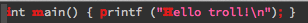

[](http://melpa.org/#/unicode-troll-stopper)

# Emacs Unicode Troll Stopper

A minor mode for highlighting Unicode homoglyphs. Inspired by [vim-troll-stopper](https://github.com/vim-utils/vim-troll-stopper).

```
Replace a semicolon (;) with a greek question mark (;) in your friend's
C# code and watch them pull their hair out over the syntax error

— Peter Ritchie (@peterritchie) November 16, 2014
```

In recent times, a vicious beast known only as the "Unicode troll" has risen
from the abyss, wielding his fearsome tool, the Unicode homoglyph. Looking
nearly identical to common ASCII characters, these homoglyphs hide in code,
lying in wait for an unsuspecting programmer to devour whole without warning.

Don't be the next victim. Enable `unicode-troll-stopper-mode` and force these
vicious beasts from the shadows in which they lurk.

```emacs-lisp
(add-hook 'some-major-mode-hook #'unicode-troll-stopper-mode)
```

Behold! Your code is safe once again.




### Getting It

Available on [MELPA](https://melpa.org/#/unicode-troll-stopper). 

```emacs-lisp
(package-initialize)
(add-to-list 'package-archives '("melpa" . "http://melpa.milkbox.net/packages/"))
(package-install 'unicode-troll-stopper)
```

### License

[MIT](https://github.com/camsaul/emacs-unicode-troll-stopper/blob/master/LICENSE)
